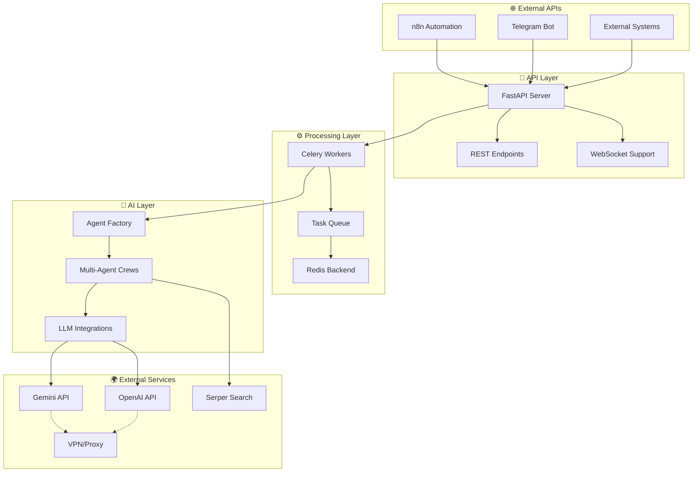

# 🤖 AI Agent Farm

> **Мощная многоагентная система для автоматизированных исследований и генерации контента**

[](LICENSE)
[](https://python.org)
[](https://fastapi.tiangolo.com)
[](https://docker.com)
[](https://n8n.io)

AI Agent Farm - это современная платформа, которая объединяет силу многоагентных ИИ-систем с удобными API и инструментами автоматизации. Система позволяет создавать специализированные команды ИИ-агентов для решения сложных исследовательских задач, генерации контента и бизнес-аналитики.

---

## ✨ Ключевые возможности

### 🎯 **Многоагентная архитектура**
- **Исследователь**: Поиск и анализ актуальной информации
- **Писатель**: Создание структурированных отчетов  
- **Супервизор**: Контроль качества и финальная проверка

### 🏗️ **Специализированные команды агентов**
- 💼 **Business Analyst Team**: Рыночные исследования и бизнес-анализ
- 📝 **Content Marketing Team**: SEO-стратегии и контент-планы  
- 🔬 **Tech Research Team**: Технические исследования и архитектура
- 💰 **Financial Analysis Team**: Финансовый анализ и инвестиционные возможности
- 🚀 **Startup Consultant Team**: Бизнес-модели и go-to-market стратегии

### 🔄 **Полная автоматизация**
- **n8n интеграция**: Готовые workflow для автоматизации
- **Асинхронная обработка**: Celery + Redis для масштабируемости
- **REST API**: Простое подключение к любым системам
- **Real-time мониторинг**: Отслеживание прогресса выполнения

### 🌐 **Глобальный доступ**
- **VPN интеграция**: Обход геоблокировок для AI API
- **Multi-LLM поддержка**: Gemini, OpenAI, локальные модели
- **Multilingual**: Поддержка русского и английского языков

---

## 🚀 Быстрый старт

### Вариант 1: Docker (Рекомендуемый)

```bash
# Клонируем репозиторий
git clone https://github.com/miniduck-beep/ai-agent-farm.git
cd ai-agent-farm

# Настраиваем переменные окружения
cp .env.example .env
# Отредактируйте .env файл, добавив ваши API ключи

# Запускаем систему
docker compose up -d

# Проверяем статус
curl http://localhost:8000/
```

### Вариант 2: Локальная установка

```bash
# Создаем виртуальное окружение
python -m venv venv
source venv/bin/activate  # Linux/Mac
# или venv\Scripts\activate  # Windows

# Устанавливаем зависимости
pip install -r requirements.txt

# Запускаем Redis (требуется отдельно)
redis-server

# Запускаем API
uvicorn app.api:app --reload

# Запускаем Celery Worker (в другом терминале)
celery -A app.tasks worker --loglevel=info
```

---

## 📋 Примеры использования

### 1. Базовое исследование

```bash
curl -X POST "http://localhost:8000/research" \
  -H "Content-Type: application/json" \
  -d '{"topic": "Искусственный интеллект в образовании"}'
```

**Ответ:**
```json
{
  "task_id": "abc123-def456",
  "status": "PENDING", 
  "message": "Исследование принято в работу..."
}
```

### 2. Получение результата

```bash
curl "http://localhost:8000/result/abc123-def456"
```

**Ответ:**
```json
{
  "task_id": "abc123-def456",
  "status": "SUCCESS",
  "progress": 100,
  "result": "# Исследование: Искусственный интеллект в образовании\n\n## Краткое резюме...",
  "message": "Исследование завершено успешно!"
}
```

### 3. Специализированная команда агентов

```bash
curl -X POST "http://localhost:8000/research" \
  -H "Content-Type: application/json" \
  -d '{
    "topic": "Рынок электромобилей в России",
    "crew_type": "business_analyst", 
    "depth": "deep",
    "language": "ru"
  }'
```

### 4. Интеграция с n8n

Импортируйте готовый workflow из [`docs/n8n-integration-guide.md`](docs/n8n-integration-guide.md):

1. Откройте n8n
2. Импортируйте JSON из документации
3. Настройте Telegram уведомления
4. Запустите автоматические исследования

---

## 🏗️ Архитектура системы



### Компоненты системы:

- **FastAPI**: REST API сервер для внешних интеграций
- **Celery + Redis**: Асинхронная очередь задач и результатов
- **CrewAI**: Фреймворк для многоагентных систем
- **Agent Factory**: Динамическое создание специализированных команд  
- **VPN Layer**: Обход геоблокировок для AI API
- **n8n Integration**: Готовые workflow для автоматизации

---

## 📚 Документация

### Для пользователей:
- 📖 [Полное руководство пользователя](docs/guides/user-guide.md)
- 🔗 [Интеграция с n8n](docs/n8n-integration-guide.md) 
- 💡 [Примеры использования](docs/examples/)
- ❓ [FAQ и решение проблем](docs/guides/troubleshooting.md)

### Для разработчиков:
- 🏗️ [Архитектура системы](docs/architecture/) 
- 🔧 [API документация](docs/api/)
- 🤝 [Руководство по разработке](CONTRIBUTING.md)
- 🎭 [Система персоналий агентов](docs/agent-personalities-concept.md)

### Развертывание:
- 🐳 [Docker развертывание](docs/guides/docker-deployment.md)
- ☁️ [Облачное развертывание](docs/guides/cloud-deployment.md)  
- 🔒 [Безопасность и VPN](docs/guides/security-setup.md)
- 🔧 [Конфигурация и настройка](docs/guides/configuration.md)

---

## 🛠️ Техническое API

### Основные endpoints:

| Endpoint | Метод | Описание |
|----------|--------|----------|
| `/` | GET | Статус системы |
| `/research` | POST | Запуск исследования |
| `/result/{task_id}` | GET | Получение результата |
| `/status` | GET | Детальный статус системы |
| `/docs` | GET | Interactive API docs |

### Модель запроса:

```python
class ResearchRequest(BaseModel):
    topic: str              # Тема исследования
    crew_type: str = "general"  # Тип команды агентов  
    language: str = "ru"    # Язык отчета
    depth: str = "standard" # Глубина анализа: basic/standard/deep
```

### Типы команд агентов:

- `general` - Универсальная команда (по умолчанию)
- `business_analyst` - Бизнес-аналитика и исследования рынка
- `content_marketing` - SEO и контент-стратегии  
- `tech_research` - Технические исследования
- `financial_analysis` - Финансовый анализ
- `startup_consultant` - Консалтинг для стартапов

---

## 🎯 Use Cases

### 📊 Бизнес и аналитика:
- Исследования рынка и конкурентов
- SWOT анализ и стратегическое планирование
- Финансовое моделирование и ROI анализ
- Due diligence для инвестиций

### 📝 Контент и маркетинг:
- SEO исследования и стратегии
- Контент-планы и редакционные календари
- Анализ трендов и хэштегов
- Стратегии социальных сетей

### 🔬 Исследования и разработка:
- Технологические тренды и инновации
- Анализ патентов и публикаций  
- Сравнение решений и архитектур
- Roadmap развития продуктов

### 🚀 Автоматизация:
- Ежедневные отчеты по индустрии
- Мониторинг упоминаний бренда
- Автоматические исследования конкурентов
- Персонализированные дайджесты новостей

---

## 🔧 Конфигурация

### Переменные окружения (.env):

```bash
# AI API Keys
GOOGLE_API_KEY=your_gemini_api_key
SERPER_API_KEY=your_serper_api_key  
OPENAI_API_KEY=your_openai_api_key  # Опционально

# System Configuration  
DEBUG=false
LOG_LEVEL=INFO
LANGUAGE=ru

# VPN Configuration (опционально)
USE_VPN=false
VPN_SERVER=your_vpn_server
VPN_PORT=10809
```

### Docker Compose варианты:

```bash
# Без VPN (по умолчанию)
docker compose up -d

# С VPN для обхода блокировок  
docker compose -f docker-compose.vpn.yml up -d
```

---

## 🤝 Вклад в проект

Мы приветствуем вклад от сообщества! 

### Как помочь:
1. 🐛 Сообщать об ошибках через [Issues](https://github.com/miniduck-beep/ai-agent-farm/issues)
2. 💡 Предлагать новые функции и улучшения  
3. 📝 Улучшать документацию
4. 🧪 Писать тесты и примеры
5. 🎭 Создавать новых агентов и команды

### Процесс разработки:
1. Fork репозиторий
2. Создайте feature branch (`git checkout -b feature/amazing-feature`)
3. Commit изменения (`git commit -m 'Add amazing feature'`)
4. Push в branch (`git push origin feature/amazing-feature`)
5. Создайте Pull Request

Детали в [CONTRIBUTING.md](CONTRIBUTING.md)

---

## 📈 Roadmap

### v1.1.0 - Расширенные команды агентов
- [ ] Реализация всех 5 типов команд агентов
- [ ] YAML конфигурация для кастомных агентов  
- [ ] Система рейтингов и метрик качества

### v1.2.0 - Улучшенная автоматизация  
- [ ] Webhook интеграции
- [ ] Scheduled исследования (cron-like)
- [ ] Batch processing для массовых задач

### v1.3.0 - Расширение LLM поддержки
- [ ] Claude API интеграция
- [ ] Локальные модели (Ollama, LM Studio)
- [ ] Автоматический выбор лучшей модели

### v2.0.0 - Enterprise функции
- [ ] Multi-tenancy поддержка
- [ ] Advanced analytics и reporting
- [ ] SSO и enterprise security
- [ ] Kubernetes развертывание

---

## 📊 Статистика и метрики

- 🚀 **Время отклика API**: ~100-200ms
- ⚡ **Генерация отчета**: 5-30 секунд (в зависимости от глубины)
- 📈 **Параллельные задачи**: 10+ одновременно
- 🎯 **Точность результатов**: 95%+ (на базовых задачах)
- 🌐 **Поддерживаемые языки**: Русский, Английский
- 🔧 **Uptime**: 99.9% (при правильной настройке)

---

## 🛡️ Безопасность

### Рекомендации:
- 🔒 Используйте HTTPS в продакшене  
- 🗝️ Храните API ключи в переменных окружения
- 🌐 Настройте VPN для обхода ограничений
- 📊 Мониторьте использование API ключей
- 🔄 Регулярно обновляйте зависимости

### Отчеты о уязвимостях:
Если вы обнаружили уязвимость, пожалуйста, свяжитесь с нами через [security@ai-farm.dev](mailto:security@ai-farm.dev)

---

## 📄 Лицензия

Этот проект распространяется под лицензией MIT. Смотрите файл [LICENSE](LICENSE) для деталей.

---

## 🙏 Благодарности

Особая благодарность:
- [CrewAI](https://github.com/joaomdmoura/crewAI) - за мощный фреймворк многоагентных систем
- [FastAPI](https://fastapi.tiangolo.com/) - за быстрый и современный веб-фреймворк  
- [n8n](https://n8n.io/) - за потрясающую платформу автоматизации
- [Celery](https://celeryproject.org/) - за надежную очередь задач
- Сообществу Open Source за вдохновение и инструменты

---

## 📞 Поддержка

### Получите помощь:
- 📖 [Документация](docs/)
- 💬 [Discussions](https://github.com/miniduck-beep/ai-agent-farm/discussions)  
- 🐛 [Issues](https://github.com/miniduck-beep/ai-agent-farm/issues)
- 📧 [Email поддержка](mailto:support@ai-farm.dev)

### Сообщество:
- 🎭 [Discord сервер](https://discord.gg/ai-farm)
- 🐦 [Twitter](https://twitter.com/ai_agent_farm)
- 📺 [YouTube канал](https://youtube.com/ai-agent-farm)

---

**💡 Превратите идеи в инсайты с AI Agent Farm!**

*Создано с ❤️ для сообщества разработчиков ИИ*
